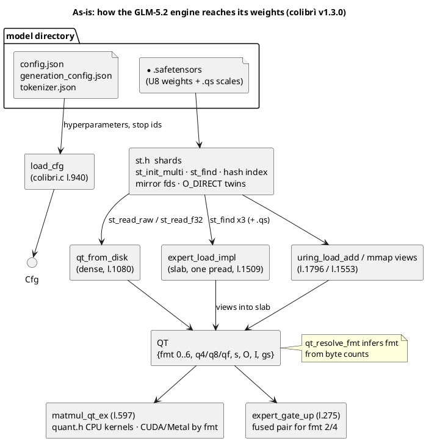
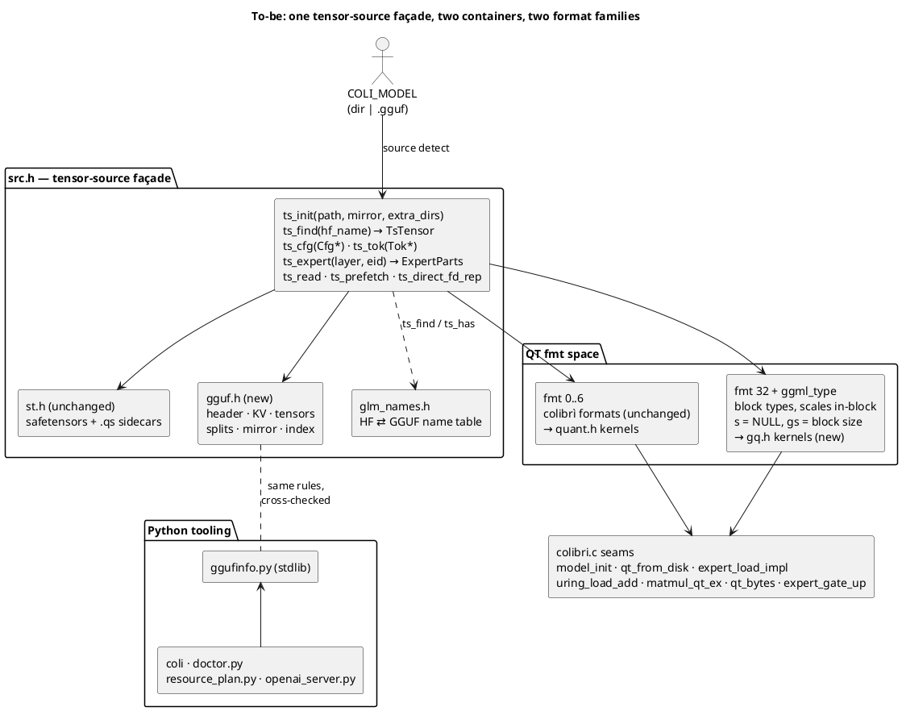
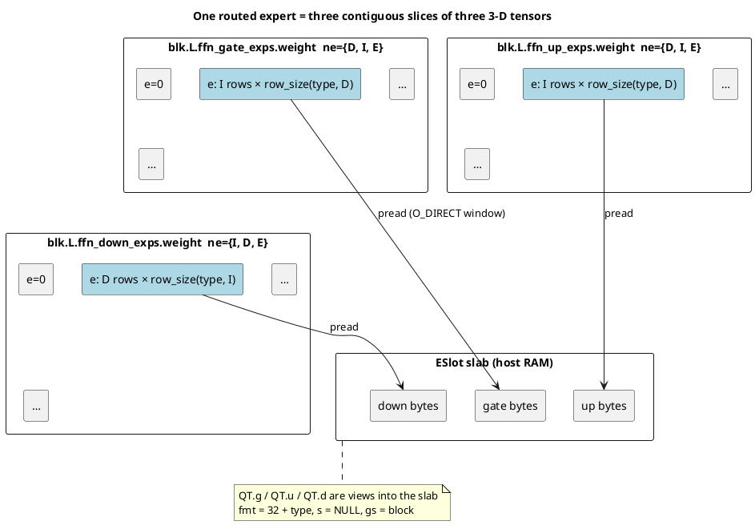

# GGUF support — architecture

Status: **proposal, awaiting owner review**. What the system must do:
`../02_Specifications/gguf-specification.md`. Progress: `../04_Tasks/tasks.md`.
Everything below is written against `06_Code/c/colibri.c` at upstream commit
`ecade07` (colibrì v1.3.0); line references are to that revision. Paths are
relative to `06_Code/` unless stated otherwise. Diagrams are PlantUML.

## 1. Design goals, in one paragraph

Add a second **model source** (GGUF) and a second **weight format family**
(ggml block types) to the GLM-5.2 engine without touching what makes colibrì
colibrì: the expert tiering, the learning cache, the I/O engine and the
precision invariant. The engine keeps asking for HF-named tensors and
`(layer, expert)` pairs; a thin source layer answers from either safetensors or
GGUF. Quantized blocks are computed on as stored. All new code is pure C in
new headers, compiled into the default build, with the safetensors path kept
byte-for-byte identical (proven by the existing oracle gate).

## 2. As-is: the seams this design hooks into



Facts the design depends on:

- **`QT` is the universal weight handle.** Every consumer (attention,
  shared experts, routed experts, MTP, indexer, GPU upload) reads
  `fmt/q4/q8/qf/s/O/I/gs`. Adding formats = adding `fmt` codes + kernels.
- **Expert identity is `(layer, eid)`** everywhere above the loader (LRU,
  pin, pilot, usage counters, Brain/Atlas, `.coli_usage`). Only
  `expert_load_impl`, `uring_load_add`, `expert_prefetch` and the mmap arm
  build tensor *names*.
- **Dense loading is name-driven** through `qt_load(m, "model.layers.%d.…")`
  and `ld(m, …)`; `model_init` (l.1161) is the single assembly point.
- **The slab contract**: `s->slab` holds the three expert matrices back to
  back, `s->fslab` the f32 scales; `QT.q4` points into the slab; slab has
  `+8192` bytes of slack so an O_DIRECT window read can start 4 KiB before the
  tensor.
- **GPU backends** take `(weights, scales, fmt, I, O, gs)` and return 0 for
  what they cannot handle; the caller then stays on CPU.

## 3. To-be: component view



New files (all header-only C, static functions, like the rest of the tree):

| File | Role | ~Size |
|---|---|---|
| `c/gguf.h` | GGUF v3 parser: header, KV store, tensor table, splits, name hash, mirror validation, bounds checks. No model knowledge. | 600 lines |
| `c/gq.h` | ggml block formats: type table (`block_size`, `type_size`), `row_size`, dequant-row for each type, GEMV/GEMM kernels (scalar + AVX2 + NEON), fused gate+up pair, selftests. No I/O. | 900 lines |
| `c/src.h` | Tensor-source façade over `st.h`/`gguf.h`; expert part locator; `Cfg`/`Tok` fill from GGUF KV. | 400 lines |
| `c/glm_names.h` | The HF⇄GGUF tensor name table for `glm-dsa` (one array, one lookup function). | 100 lines |
| `c/ggufinfo.py` | stdlib GGUF reader for the Python tools. | 250 lines |
| `c/tests/test_gguf.c`, `test_gq_kernels.c`, `test_gguf_load.c`, `fuzz_gguf.c`, `tests/test_ggufinfo.py`, `tools/make_gguf_fixture.py`, `tools/gq_ref.py` | Tests and fixture generators. | — |

Touched files: `c/colibri.c` (seams listed in §8), `c/coli`, `c/doctor.py`,
`c/resource_plan.py`, `c/openai_server.py` (model-dir assumptions), `c/Makefile`
(test targets), docs.

## 4. `gguf.h` — the container reader

### 4.1 On-disk format handled

```
header      : u32 magic "GGUF" · u32 version (=3) · u64 n_tensors · u64 n_kv
kv[n_kv]    : string key · u32 type · value      (types 0..12; ARRAY=9 nests)
tensors[n]  : string name · u32 n_dims(≤4) · u64 ne[n_dims] · u32 ggml_type · u64 offset
pad         : to general.alignment (default 32)
data        : tensor bytes; tensor i at data_start + offset_i, size ne[1..]·row_size(type, ne[0])
```

Strings are `u64 len + bytes` (not NUL-terminated). Arrays are
`u32 elem_type + u64 n + elems`. All little-endian.

### 4.2 API

```c
typedef struct { int fd, dfd, mfd, mdfd; char *path; int64_t size, data_off; int split_no; } GgufFile;
typedef struct {
    char    *name;          /* "blk.3.ffn_gate_exps.weight" */
    int      type;          /* ggml type id */
    int      n_dims; int64_t ne[4];
    int64_t  nbytes;        /* ne[1]*ne[2]*ne[3] * row_size(type, ne[0]) */
    int      file;          /* index into GgufSet.files */
    int64_t  off;           /* ABSOLUTE offset in that file */
} GgufTensor;
typedef struct { char *key; int type; /* scalar | string | array view */ ... } GgufKV;
typedef struct {
    GgufFile   files[GGUF_MAX_SPLITS];  int nfiles;        /* ordered by split.no */
    GgufKV    *kv;  int nkv;                               /* from split 0 (all splits carry metadata) */
    GgufTensor*t;   int nt;   int *hidx; int hcap;         /* FNV open-addressing, as st.h */
    int64_t    alignment;
} GgufSet;

static void        gguf_open_set(GgufSet *G, const char *path_or_dir, const char *extra_dirs);
static int         gguf_mirror_init(GgufSet *G, const char *dir);          /* dual-SSD, FR-7 */
static GgufTensor *gguf_find(GgufSet *G, const char *name);
static const GgufKV *gguf_kv(GgufSet *G, const char *key);                /* NULL if absent */
static int64_t     gguf_kv_i64(GgufSet*,const char*,int64_t dflt);        /* any int type → i64 */
static double      gguf_kv_f64(GgufSet*,const char*,double dflt);
static const char *gguf_kv_str(GgufSet*,const char*);                      /* arena-owned */
static int64_t     gguf_kv_arr_len(GgufSet*,const char*);
static const char *gguf_kv_arr_str(GgufSet*,const char*,int64_t i);       /* tokens, merges */
static int32_t     gguf_kv_arr_i32(GgufSet*,const char*,int64_t i);       /* token_type */
static int         gguf_fd_rep(GgufSet*,int file,int rep), gguf_direct_fd_rep(GgufSet*,int file,int rep);
```

`gguf_open_set` accepts a file, a directory (picks `*.gguf`; if several and
one has `split.count`, loads that set; otherwise refuses ambiguity) or the
first part of a split set; `extra_dirs` (= `COLI_MODEL_DIRS`) is searched for
missing parts by basename, mirroring `st_scan_dir`.

### 4.3 Validation (NFR-4), all fatal with the key/tensor name

- magic, version == 3, `n_tensors ≤ 1<<20`, `n_kv ≤ 1<<16`;
- string length ≤ 64 KiB (keys/names/tokens), total KV bytes ≤ 1 GiB
  (155k-token vocabularies with merges are ~20 MB);
- array length ≤ 1<<24, nested arrays ≤ depth 2;
- `n_dims ≤ 4`, `ne[i] ≥ 1`, products overflow-checked (`__builtin_mul_overflow`);
- type known to `gq.h`'s table (unknown types are *indexed* — so `doctor` can
  list them — but any attempt to *use* one fails with FR-10's message);
- `ne[0] % block_size == 0` for block types;
- `alignment` power of two ≤ 1 MiB; `data_off % alignment == 0`;
- `off % alignment == 0` and `data_off + off + nbytes ≤ file size`;
- split: `split.no` sequential from 0, `split.count` equal across parts,
  `Σ tensors == split.tensors.count`, all parts same `general.alignment`;
- duplicate tensor names refused.

The KV store is parsed into a single malloc'd arena (strings point into it);
tensor data is **never** read by `gguf.h` except by the explicit `pread`
helpers the façade calls, preserving the "headers only at startup" RSS
property of `st.h`.

### 4.4 Mirror (dual-SSD)

Same rule as `st_mirror_init`: a candidate part is accepted if its size equals
the primary's and the bytes `[0, data_off)` (header + KV + tensor table +
padding) are identical; then every `(off, nbytes)` is valid on both copies.
`expert_route(layer, eid)` is unchanged (it hashes identity, not names).

## 5. `gq.h` — ggml block formats on the CPU

### 5.1 Type table

| id | name | block | bytes/block | bpw | layout (from `ggml-common.h`) |
|---|---|---|---|---|---|
| 0 | `F32` | 1 | 4 | 32 | — |
| 1 | `F16` | 1 | 2 | 16 | IEEE half |
| 30 | `BF16` | 1 | 2 | 16 | bf16 |
| 2 | `Q4_0` | 32 | 18 | 4.5 | `f16 d; u8 qs[16]` nibbles, value `(q-8)·d`; low nibble = element i, high = i+16 |
| 8 | `Q8_0` | 32 | 34 | 8.5 | `f16 d; i8 qs[32]` |
| 12 | `Q4_K` | 256 | 144 | 4.5 | `f16 d, dmin; u8 scales[12]; u8 qs[128]` — 8 sub-blocks of 32, 6-bit scale+min each, value `d·sc·q − dmin·m` |
| 13 | `Q5_K` | 256 | 176 | 5.5 | `Q4_K` + `u8 qh[32]` high bits |
| 14 | `Q6_K` | 256 | 210 | 6.56 | `u8 ql[128]; u8 qh[64]; i8 scales[16]; f16 d` — 16 sub-blocks of 16, value `d·sc·(q−32)` |

Later phases append `Q2_K` (84 B), `Q3_K` (110 B), `Q4_1`/`Q5_0`/`Q5_1`,
`IQ4_NL`/`IQ4_XS` (non-linear LUT), `MXFP4` (17 B; the engine already has an
e2m1 kernel for Kimi K3 — reuse). The table is data; `gq_row_size(type, ne0)`
and `gq_supported(type)` are the only entry points the rest of the code uses.

### 5.2 Kernels

For each supported type `T`:

```c
static void   gq_deq_row_T (const uint8_t *row, float *out, int I);           /* reference */
static float  gq_dot_row_T (const uint8_t *row, const float *x, int I);       /* scalar */
static float  gq_dot_row_T_avx2 / _neon (...);                                /* SIMD */
static void   gq_axpy_row_T(const uint8_t *row, float coef, float *acc, int I);  /* for qt_addrow (MLA absorb) */
static void   gq_matmul(float *y, const float *x, int type, const uint8_t *w, int S, int I, int O);
static void   gq_matmul_pair(float *yg, float *yu, const float *x, int type,
                             const uint8_t *wg, const uint8_t *wu, int S, int I, int O);  /* fused gate+up */
static int    gq_selftest(void);   /* scalar vs SIMD, random rows, every type; run at startup like i4_acc512_selftest */
```

`gq_matmul` is the same OMP shape as `matmul_i4_grouped`: parallel over
output rows, inner loop over blocks, f32 accumulation. The K-quant inner loop
unpacks the 6-bit `scales[12]` once per super-block (the standard
`get_scale_min_k4` bit layout) and then runs eight 32-wide sub-block FMAs.
Everything is derived from the public struct definitions; no code is copied
from ggml.

Numerics: f32 activations × exactly dequantized weights, fma in f32. This is
the "exact" class of kernels (`allow_idot=0` semantics). An int8-activation
twin (`Q8_K`-style blocks, `bsums` trick) is Phase 5 behind `IDOT`, with the
same quality measurement discipline as the existing IDOT note.

### 5.3 `QT` extension

```c
#define QT_FMT_GGML_BASE 32
#define QT_FMT_GGML(type) (QT_FMT_GGML_BASE + (type))      /* Q4_K → 44, Q6_K → 46, Q8_0 → 40, F16 → 33 */
static inline int qt_is_ggml(int fmt){ return fmt >= QT_FMT_GGML_BASE; }
static inline int qt_ggml_type(int fmt){ return fmt - QT_FMT_GGML_BASE; }
```

For a GGML-backed `QT`: `q4` → block bytes (row-major, `O` rows of
`gq_row_size(type, I)`), `s = NULL`, `gs = block_size`, `qf/q8 = NULL`.
`qt_bytes` gains one line (`O * gq_row_size`). `F32` GGUF tensors map to the
existing `fmt 0` (`qf`), so nothing downstream changes for them.

## 6. `src.h` — one façade, two sources

```c
typedef enum { TS_SAFETENSORS, TS_GGUF } TsKind;
typedef struct {            /* what a weight consumer needs; superset of st_tensor */
    const char *name; int fd, file; int64_t off, nbytes, numel;
    int st_dtype;           /* safetensors: 0 BF16 1 F16 2 F32 3 U8 */
    int ggml_type;          /* gguf: type id; -1 for safetensors */
    int n_dims; int64_t ne[4];
} TsTensor;
typedef struct { TsTensor w; TsTensor q; int has_q; } TsPart;   /* weight + optional .qs sidecar */
typedef struct { int n; TsPart p[3]; /* gate, up, down */ int fmt[3]; int gs[3]; } ExpertParts;

typedef struct { TsKind kind; shards S; GgufSet G; } TensorSource;

static void  ts_init(TensorSource*, const char *path, const char *extra_dirs);
static int   ts_mirror_init(TensorSource*, const char *dir);
static int   ts_find(TensorSource*, const char *hf_name, TsTensor *out);       /* 1 if present */
static int   ts_has(TensorSource*, const char *hf_name);
static void  ts_read_raw(TensorSource*, const TsTensor*, void *dst, int rep, int drop);
static int64_t ts_read_f32(TensorSource*, const char *hf_name, float *dst, int64_t cap, int drop); /* widens F16/BF16/F32 */
static void  ts_prefetch(TensorSource*, const TsTensor*, int rep);
static int   ts_expert(TensorSource*, const Cfg*, int layer, int eid, ExpertParts *out);
static void  ts_cfg(TensorSource*, Cfg*, const char *path);    /* json for ST, KV for GGUF */
static void  ts_tok(TensorSource*, Tok*, const char *path);    /* tokenizer.json for ST, KV arrays for GGUF */
static const char *ts_describe(TensorSource*);                 /* "gguf · glm-dsa · Q4_K 71% Q6_K 27% F32 2% · 9 parts" */
```

Design rules:

- **Safetensors behaviour is delegated, not re-implemented.** For
  `TS_SAFETENSORS` every call forwards to the existing `st_*` function with
  the same arguments; `ExpertParts` is filled from `st_find` of the three
  names and their `.qs` twins. This is what makes NFR-1 provable: the
  safetensors path executes the same code as before, through one indirection.
- **Name translation happens only in `ts_find`/`ts_has`** via `glm_names.h`.
  The engine keeps its HF vocabulary; a reviewer can diff the table against
  llama.cpp's `TENSOR_NAMES`.
- `ts_expert` is the **only** place that knows experts are 3-D slices in GGUF
  and triplets of tensors in safetensors.

### 6.1 Name table (`glm_names.h`), `glm-dsa`

| HF name (engine) | GGUF name |
|---|---|
| `model.embed_tokens.weight` | `token_embd.weight` |
| `model.norm.weight` | `output_norm.weight` |
| `lm_head.weight` | `output.weight` |
| `model.layers.N.input_layernorm.weight` | `blk.N.attn_norm.weight` |
| `model.layers.N.post_attention_layernorm.weight` | `blk.N.ffn_norm.weight` |
| `model.layers.N.self_attn.q_a_proj.weight` | `blk.N.attn_q_a.weight` |
| `model.layers.N.self_attn.q_a_layernorm.weight` | `blk.N.attn_q_a_norm.weight` |
| `model.layers.N.self_attn.q_b_proj.weight` | `blk.N.attn_q_b.weight` |
| `model.layers.N.self_attn.kv_a_proj_with_mqa.weight` | `blk.N.attn_kv_a_mqa.weight` |
| `model.layers.N.self_attn.kv_a_layernorm.weight` | `blk.N.attn_kv_a_norm.weight` |
| `model.layers.N.self_attn.kv_b_proj.weight` | `blk.N.attn_kv_b.weight` **or** (`blk.N.attn_k_b.weight`, `blk.N.attn_v_b.weight`) — see §7.3 |
| `model.layers.N.self_attn.o_proj.weight` | `blk.N.attn_output.weight` |
| `model.layers.N.mlp.gate_proj/up_proj/down_proj.weight` (dense layers) | `blk.N.ffn_gate/ffn_up/ffn_down.weight` |
| `model.layers.N.mlp.gate.weight` | `blk.N.ffn_gate_inp.weight` |
| `model.layers.N.mlp.gate.e_score_correction_bias` | `blk.N.exp_probs_b.bias` |
| `model.layers.N.mlp.shared_experts.{gate,up,down}_proj.weight` | `blk.N.ffn_{gate,up,down}_shexp.weight` |
| `model.layers.N.mlp.experts.E.{gate,up,down}_proj.weight` | slice `E` of `blk.N.ffn_{gate,up,down}_exps.weight` |
| `model.layers.N.self_attn.indexer.wq_b.weight` | `blk.N.indexer.attn_q_b.weight` |
| `model.layers.N.self_attn.indexer.wk.weight` | `blk.N.indexer.attn_k.weight` |
| `model.layers.N.self_attn.indexer.weights_proj.weight` | `blk.N.indexer.proj.weight` |
| `model.layers.N.self_attn.indexer.k_norm.{weight,bias}` | `blk.N.indexer.k_norm.{weight,bias}` |
| `model.layers.L.eh_proj.weight` (L = n_layers, MTP) | `blk.L.nextn.eh_proj.weight` |
| `model.layers.L.enorm.weight` / `hnorm.weight` | `blk.L.nextn.enorm.weight` / `nextn.hnorm.weight` |
| `model.layers.L.shared_head.norm.weight` | `blk.L.nextn.shared_head_norm.weight` |
| (MTP layer attention / MoE tensors) | `blk.L.attn_*`, `blk.L.ffn_*` — regular block names at index `n_layer` |

The names on the right are taken from llama.cpp's `llama-arch.cpp` tensor
table for `glm-dsa` at the time of writing; they are the one thing most likely
to need a patch when a new converter version appears, which is why they live
in one file. (`blk.N.indexer.*` spellings were verified against the loader
source; whether `nextn.embed_tokens` / `nextn.shared_head_head` are present
depends on the converter — both are optional for colibrì, which reuses the
main embedding and head as today.)

## 7. Model assembly for `glm-dsa`

### 7.1 `Cfg` from metadata (`ts_cfg`, GGUF arm)

| `Cfg` field | GGUF key (`glm-dsa.` prefix unless noted) | Notes |
|---|---|---|
| `hidden` | `embedding_length` | |
| `n_layers` | `block_count − nextn_predict_layers` | llama.cpp counts the NextN block **inside** `block_count` (GLM-5.2: 79 = 78 + 1, MTP tensors under `blk.78.*`; verified on `unsloth/GLM-5.2-GGUF`, see [inspection report](../08_Documents/inspection-glm52-ud-q4_k_xl-2026-10-05.md)) |
| `n_heads` | `attention.head_count` | |
| `n_experts` | `expert_count` | may be < 256 (REAP) |
| `topk` | `expert_used_count` | |
| `moe_inter` | `expert_feed_forward_length` | |
| `dense_inter` | `feed_forward_length` | |
| `first_dense` | `leading_dense_block_count` | |
| `q_lora`, `kv_lora` | `attention.q_lora_rank`, `attention.kv_lora_rank` | |
| `qk_rope` | `rope.dimension_count` | |
| `qk_nope` | `attention.key_length_mla − qk_rope` | `key_length_mla` = nope + rope |
| `v_head` | `attention.value_length_mla` | |
| `n_shared` | `expert_shared_count` | |
| `routed_scale` | `expert_weights_scale` | |
| `norm_topk` | `expert_weights_norm` (bool) | |
| (gating) | `expert_gating_func` must be `2` (sigmoid); else refuse | matches "requires n_group=1" posture |
| `n_group`, `topk_group` | `expert_group_count` / `expert_group_used_count` if present, else 1/1 | refuse ≠ 1 as today |
| `eps` | `attention.layer_norm_rms_epsilon` | |
| `theta` | `rope.freq_base` | |
| `vocab` | `len(tokenizer.ggml.tokens)` (cross-check `output.weight.ne[1]`) | |
| `index_topk/nh/hd` | `attention.indexer.top_k`, `.head_count`, `.key_length` | 0 if absent → `has_dsa=0` |
| `idx_type[]` | `attention.indexer.types` array if present, else derived from which layers carry `indexer.attn_k` | the unsloth file has no `types` key and indexer tensors on **every** block |
| `stop_ids` | `tokenizer.ggml.eos_token_id`, `eot_token_id`, + by-name `<|user|>`, `<|observation|>`, `<|endoftext|>` | FR-20 |
| (MTP present) | `nextn_predict_layers ≥ 1` and `blk.<n_layers>.nextn.*` present | FR-23; `eh_proj` is `Q8_0` in `UD-Q4_K_XL` |

Range validation reuses the `CKR` macro block verbatim (factor it into a
`cfg_validate(Cfg*)` called by both arms).

### 7.2 Dense weights

`qt_load` → `qt_from_disk` gets a GGUF arm:

```c
TsTensor t; ts_find(&m->src, name, &t);
if(m->src.kind==TS_GGUF){
    if(t.ggml_type==GGML_F32){ qt_alloc f32; ts_read_raw; fmt=0; }
    else if(!gq_supported(t.ggml_type)) die("… is not supported yet");
    else { fmt=QT_FMT_GGML(type); q4=qalloc(t.nbytes); ts_read_raw(...); s=NULL; gs=gq_block(type); }
    check t.ne[0]==I && rows==O  /* shape validation replaces qt_resolve_fmt's byte-count inference */
}
```

Norm vectors (`ld`) go through `ts_read_f32`, which widens `F16`/`BF16`/`F32`
(lossless). Router (`ffn_gate_inp`) and bias (`exp_probs_b`) are `F32` in
llama.cpp quantizations; if a file stores them in `F16`, widening is still
lossless. `io_bits`/`dbits`/`ebits` have no meaning for GGUF (the file decides)
and are reported as "from file".

### 7.3 MLA weight reconciliation (FR-18)

The engine computes with `kv_b` as one matrix `[H·(qk_nope+v_head), kv_lora]`
(`model_init`, l.1192) and, under `ABSORB`, uses per-row access (`qt_addrow`).
llama.cpp's `glm-dsa` loader declares the **absorbed split**:

- `attn_k_b` `{qk_nope, kv_lora, n_head}` → per head, a `[kv_lora rows × qk_nope]`
  matrix = the **transpose** of kv_b's k-slice for that head;
- `attn_v_b` `{kv_lora, v_head, n_head}` → per head `[v_head rows × kv_lora]` =
  kv_b's v-slice in the engine's orientation (concatenate heads → direct view).

Verified on `unsloth/GLM-5.2-GGUF` (`UD-Q4_K_XL`): **no `attn_kv_b`**; `attn_k_b`
`{192, 512, 64}` and `attn_v_b` `{512, 256, 64}`, both `Q8_0`, on all 79 blocks.

Policy, in order:

1. If `blk.N.attn_kv_b.weight` exists → use it as `kv_b` (shape check), done.
2. Else build `kv_b`'s **v part** as a view/copy of `attn_v_b` (same orientation)
   and its **k part** by **widening** `attn_k_b` to f16 (or f32) and
   transposing per head at load. Cost: `H·qk_nope·kv_lora` values per layer
   (GLM-5.2: 64 heads × 192 × 512 → 12.6 MB f16 / 25 MB f32 per layer, ≈1.0–2.0 GB
   for 79 layers);
   lossless, so permitted by NFR-3. The resulting `kv_b` is a mixed-format
   pair (`k_b` f16/f32, `v_b` native) → two `QT`s instead of one. The
   attention code already splits k/v rows by head offset, so this is a local
   change in the kv_b consumers (`attn` and the CUDA `kv_b_shard` upload).
3. Phase 5 option: a transposed-weight kernel consuming `attn_k_b` natively
   (natural for the absorbed `q_nope · k_bᵀ` product), removing the widening.

`attn_k_b` has `ne[0] = qk_nope` (192), not a multiple of 256, so
`llama-quantize` stores it as `Q8_0`/`Q4_0`-class or `F16` — all in the v1
type set (`Q8_0` in the inspected file).

### 7.4 Tokenizer (`ts_tok`, GGUF arm)

`tok.h` is extended with `tok_load_from_arrays(Tok*, n, tokens[], merges[],
token_type[], pre)` factored out of `tok_load` (which keeps parsing
`tokenizer.json` and then calls the same constructor):

- `tokens[i]` → `id2str[i]`, `vocab[str]=i` (GGUF stores the HF byte-level
  strings unchanged for `gpt2`-type tokenizers);
- `merges[k]` `"a b"` → rank `k`;
- `token_type == 3 (CONTROL)` → `id_added=1, id_special=1`;
  `token_type == 4 (USER_DEFINED)` → `id_added=1, id_special=0` (`<think>`,
  `<tool_call>` render as text, as today); others normal;
- `tokenizer.ggml.pre == "glm4"` (and the `glm-dsa` default) → `cl100k`
  family (`o200k=0, kimi=0, rankbpe=0`); unknown `pre` → refuse, do not guess;
- `add_bos_token` honoured as the HF path honours it (GLM: no BOS; `[gMASK]<sop>`
  come from the chat template rendered by the gateway).

Acceptance test: encode/decode a fixed corpus through both constructors on
the same model and require identical ids.

### 7.5 MTP (NextN) and indexer

Both reuse today's auto-detection blocks in `model_init` through `ts_has` and
the name table; the only new logic is FR-23's precision guard:

```c
if(m->has_mtp && src.kind==TS_GGUF){
    int bits = gq_bits_per_weight(type_of("blk.L.nextn.eh_proj.weight"));   /* 8.5 for Q8_0, 6.56 for Q6_K … */
    if(bits < 8 && !(getenv("MTP") && atoi(getenv("MTP"))==1)){ warn("#8 …"); m->has_mtp=0; }
}
```

## 8. Expert streaming from GGUF

### 8.1 Locating an expert (`ts_expert`, GGUF arm)

```
gate : T = blk.L.ffn_gate_exps.weight  ne={D, I, E}   slice e: off + e·I·row_size(T.type, D)  nbytes I·row_size
up   : T = blk.L.ffn_up_exps.weight    ne={D, I, E}   same
down : T = blk.L.ffn_down_exps.weight  ne={I, D, E}   slice e: off + e·D·row_size(T.type, I)  nbytes D·row_size
fmt[k] = QT_FMT_GGML(T.type); gs[k] = block; has_q = 0
```



(`D = hidden`, `I = moe_inter`, `E = n_experts`; QT shapes are `g,u: [O=I, I=D]`,
`d: [O=D, I=I]`, exactly today's `OO/II` arrays. Verified: `ffn_gate_exps`
`{6144, 2048, 256}` Q4_K, `ffn_down_exps` `{2048, 6144, 256}` Q5_K.) Shape checks against `Cfg`
happen once per layer at startup, not per load.

### 8.2 Load path (`expert_load_impl`)

The function keeps its structure; the name-building prologue is replaced by
`ts_expert`, and the three arms become source-agnostic:

- **slab sizing**: `wtot = Σ p[k].w.nbytes`; `ftot = Σ q.nbytes/4` (0 for GGUF →
  `fslab` untouched). The MTP-vs-main size asymmetry already exercises slab
  regrowth, so a `Q6_K` down-projection next to `Q4_K` gate/up is nothing new.
- **contiguity test**: in GGUF the three slices are in three tensors → never
  contiguous → the existing "3 buffered preads" arm runs. Add the
  **per-slice O_DIRECT window** (today only the contiguous arm has it):
  `base = off & ~4095`, read `[(base, ceil(off−base+n, 4096))` into
  `slab + pos_k_aligned`, set `pos[k]` to the interior offset. Slab slack grows
  from `+8192` to `+3·8192` for GGUF sources.
- **views**: `qt[k]->fmt = parts.fmt[k]; q4 = slab+pos[k]; s = NULL; gs = block`.
  `qt_resolve_fmt` is not called for GGUF (shape and type are authoritative).
- `mir_pread`, `DISK-CLASS`, `g_drop`/`fadvise`, profiling counters: unchanged,
  they operate on `(fd, off, nbytes)`.

`uring_load_add` and the mmap arm (`map_of_fd(fd) + off`) follow the same
substitution; `expert_prefetch` issues `ts_prefetch` per part. Pilot, PIPE,
pin loading and `expert_host_ensure` call `expert_load` and are untouched.

### 8.3 Compute

`expert_gate_up`: add `else if(qt_is_ggml(wg->fmt) && wg->fmt==wu->fmt && S==1)
gq_matmul_pair(...)`. `matmul_qt_ex`: before the fmt 0/4/6 dispatch,
`if(qt_is_ggml(w->fmt)){ gq_matmul(y,x,qt_ggml_type(w->fmt),w->q4,S,w->I,w->O); return; }`.
`qt_addrow` (ABSORB path): dispatch to `gq_axpy_row_T`. CUDA/Metal: the
upload functions return 0 for `qt_is_ggml(fmt)` in v1 (explicit, with the
`[CUDA] … stays on CPU (Q4_K kernels: phase 5)` note once).

### 8.4 Byte volumes (why NFR-5 is plausible)

Bits per weight: colibrì fmt=4 gs64 = 4 + 32/64 = **4.5 bpw**; `Q4_K` =
144·8/256 = **4.5 bpw**. A pure-`Q4_K` expert therefore moves the same bytes as
today's container expert. Measured on `UD-Q4_K_XL`: gate/up `Q4_K`, down
`Q5_K` (`Q6_K` on 4 layers) → **22.81 MB per expert**, +7.5% over the 21.2 MB
of a gs64 int4 expert; 446 GB of experts in total. The A/B must report
bytes/token, not just tok/s.

The flip side of the same file: every attention, shared-expert, indexer and
embedding matrix is `Q8_0`, so the **resident dense set is 21.0 GB** against
9.9 GB for the int4 container. On a 25 GB host that leaves ~4 GB for expert
cache and KV; on 16 GB it does not fit. The precision invariant forbids
re-quantizing at load, so small hosts need a GGUF whose attention is 4–5 bit
(`UD-Q4_K_M`/`UD-Q4_K_S`, to be inspected) or phase-5 `Q8_0` residency on the
GPU. `coli doctor` already fails `memory.ram` on the dense set alone.

## 9. Python side

### 9.1 `c/ggufinfo.py` (stdlib only)

```python
class Gguf:            # one part
    kv: dict[str, object]; tensors: list[TensorInfo]; alignment; data_off; path; size
def open_set(path_or_dir, extra_dirs=()) -> list[Gguf]        # split-aware, validates split.* keys
def type_name(t), row_size(t, ne0), bits_per_weight(t)
def summarize(parts) -> dict   # arch, name, file_type, n_tensors, type mix, dense_bytes, expert_bytes,
                               # per-expert bytes (median over layers), unsupported types, mtp_bits, indexer layers
```

Used by:

- `coli`: `model_arch()` → `general.architecture` (`glm-dsa` → `glm`,
  anything else → explicit error); `need_model()` accepts a `.gguf` path or a
  directory with `*.gguf` and **does not** demand `tokenizer.json`;
  `info`/`plan` print `summarize()`; the engine is launched with
  `SNAP=<path>` as today (the C side detects the kind).
- `doctor.py`: new checks (FR-35); `model.tokenizer` passes when the GGUF
  carries `tokenizer.ggml.tokens`; `storage.mirror` compares header bytes.
- `resource_plan.py`: `analyze_model()` branches on source kind; expert bytes
  come from slice sizes; the rest of the planner (RAM/VRAM budgets, cap) is
  byte-based and unchanged.
- `openai_server.py`: `--arch auto` reads `general.architecture`; chat
  template stays the gateway's built-in GLM renderer (the GGUF's
  `tokenizer.chat_template` is ignored in v1, logged for reference).

### 9.2 CLI surface

- `COLI_MODEL=/nvme/GLM-5.2-UD-Q4_K_XL-00001-of-00009.gguf ./coli chat`
- `COLI_MODEL=/nvme/glm52_gguf/ ./coli chat` (directory holding the parts)
- `COLI_MODEL_MIRROR`, `COLI_MODEL_DIRS` as before.
- `./coli gguf inspect <path>` (FR-37) → metadata + tensor table + type mix.

### 9.3 Sidecar files

Today `.coli_usage`, `.coli_kv`, `.coli_pairs` live in the model directory.
For GGUF the model may be one file among several in a directory, so the
sidecar directory becomes `<dir>/.coli-<stem>/` where `<stem>` is the file
name without extension and without the `-NNNNN-of-NNNNN` suffix. A new
`model_sidecar_dir(path)` helper in `colibri.c` is used by `kv_persist.h`,
the usage writer and `PIN=auto`; for a safetensors directory it returns the
directory itself (unchanged behaviour).

## 10. Error handling, security and observability

- Every refusal names the **file, tensor or key** and the **rule** (same
  style as `qt_resolve_fmt`'s "refusing (untrusted container)").
- Startup prints one `[GGUF]` line: parts, arch, `general.name`, type mix,
  MTP decision, indexer decision, and which tensors (if any) stay on CPU under
  CUDA/Metal.
- `PROF=1` disk-class accounting works unchanged; a new counter
  `gguf_parts_read` exposes reads/expert (3 vs 1) so the IOPS cost is visible
  in the stats line.
- Fuzzing: `tests/fuzz_gguf.c` mutates valid fixtures (header fields, KV
  types, lengths, offsets) and asserts the parser exits with a diagnostic and
  never reads past `size` (run under ASan in the dev loop; not part of
  `make check`).

## 11. Testing strategy

### 11.1 Unit (in `make check`, stdlib/C only)

| Test | What it pins |
|---|---|
| `test_gguf.c` | parses a GGUF written by `tools/make_gguf_fixture.py` at test time (as `test_int3_load.c` writes a safetensors): all KV types, nested arrays, alignment 32 and 64, split set of 3, tensor offsets; rejects each validation rule in §4.3 (one malformed file per rule). |
| `test_gq_kernels.c` | for every supported type: C `gq_deq_row_T` == Python reference (`tools/gq_ref.py`, pure Python) bit-for-bit on random blocks (fixtures generated by the Python side, including edge cases: zero scale, max/min codes, NaN-free `f16` handling); scalar vs AVX2/NEON dot within tolerance; `gq_matmul_pair` == two `gq_matmul`. |
| `test_gguf_load.c` | builds a tiny `glm-dsa` GGUF with random weights in mixed types (`F32` norms, `Q8_0` attention, `Q4_K` gate/up, `Q6_K` down, `F16` `attn_k_b`), loads it through `model_init`, checks `Cfg`, name resolution, `ExpertParts` offsets, slab views, `qt_bytes`, MTP precision guard, `has_dsa` detection, and that `expert_load` → `gq_deq_row` reproduces the fixture's weights. Also loads the **same** model written as safetensors+`.qs` and asserts both paths yield identical `Cfg` and identical expert bytes where formats coincide. |
| `test_tok_gguf.c` | `tok_load_from_arrays` vs `tok_load(tokenizer.json)` on a synthetic vocab: identical encode/decode. |
| `tests/test_ggufinfo.py`, `test_doctor.py` additions, `test_resource_plan.py` additions | Python reader, doctor checks, planner byte accounting on fixtures. |

### 11.2 Lossless oracle (dev loop, needs torch once)

`tools/make_glm_oracle.py` already produces `c/glm_tiny` + `ref_glm.json`.
Add `tools/st2gguf.py` (stdlib + optional numpy) that writes a `glm-dsa` GGUF
**from an HF snapshot** at `F32`/`F16` (and `Q8_0`/`Q4_0`, which are simple to
quantize in Python). Gate: `SNAP=./glm_tiny.gguf TF=1 ./colibri 64 16 16` →
32/32 and 20/20, like the safetensors oracle. This needs no llama.cpp.

### 11.3 K-quant fixtures (dev loop, needs llama.cpp once)

`llama-quantize glm_tiny-f16.gguf glm_tiny-q4_k_m.gguf Q4_K_M` (and `Q6_K`,
`Q5_K_M`) produce a few-MB files checked in under `c/tests/fixtures/` with the
exact command and llama.cpp commit in `fixtures/README`. Tests: the engine's
dequantization equals the values a reference Python implementation of
`dequantize_row_q4_K` etc. produces; greedy outputs are compared to
llama.cpp's on the same file as a **top-1 agreement rate** (not required to be
exact: engines differ in accumulation order).

### 11.4 Real-model validation

- **OLMoE-1B-7B GGUF** (~4 GB public files, `olmoe` arch) as an integration
  vehicle for `gguf.h` + `gq.h` on real llama.cpp output **without** touching
  the GLM engine's assembly: a 200-line harness that reads one expert slice
  and one dense tensor from a real file and dequantizes them against the
  Python reference. Cheap, CI-adjacent (needs a download, so opt-in like
  `efficiency-report`).
- **GLM-5.2 `Q4_K_M`-class GGUF**: `coli doctor --deep`, `coli chat`,
  `coli bench` subset, and the A/B of REQUIREMENTS §9.5.

## 12. Phased plan (each phase = one PR-sized branch; the task list in `../04_Tasks/tasks.md` is authoritative)

| Phase | Branch | Deliverables | Exit criteria |
|---|---|---|---|
| **0** | (colibrì fork) | Specification + this document. | Owner review pending. |
| **1 — Reader** | `gguf/p1-reader` (fork), now `06_Code/` | `gguf.h`, `ggufinfo.py`, `tools/make_gguf_fixture.py`, `test_gguf.c`, `test_ggufinfo.py`, `coli gguf inspect`, `doctor` header/split/type checks. No engine wiring. | `make check` green on 3 OSes; inspects a real GGUF (any arch). **Done 2026-10-05**, see `../08_Documents/inspection-glm52-ud-q4_k_xl-2026-10-05.md`. |
| **2 — Kernels** | `gguf/p2-kernels` | `gq.h` (types of D2), `tools/gq_ref.py`, `test_gq_kernels.c`, startup selftest, `QT` fmt extension + `qt_bytes` + `matmul_qt_ex`/`expert_gate_up`/`qt_addrow` dispatch (dead until Phase 3). | Bit-exact dequant vs reference; SIMD parity; zero change to existing tests/oracle. |
| **3 — Assembly** | `gguf/p3-assembly` | `src.h`, `glm_names.h`, `ts_cfg`, `ts_tok` (+`tok_load_from_arrays`), `model_init` through the façade, MLA reconciliation, `test_gguf_load.c`, `test_tok_gguf.c`, `tools/st2gguf.py`, `coli`/`doctor`/`resource_plan`/gateway source detection. Experts still load via the façade's safetensors arm; GGUF experts load but only through the simple 3-read path. | **Lossless oracle 32/32 + 20/20 from an F16 GGUF**; safetensors oracle unchanged. |
| **4 — Streaming** | `gguf/p4-streaming` | per-slice O_DIRECT, mmap, uring, prefetch/pilot per part, mirror/split for GGUF, sidecar dir, MTP precision guard, indexer, stats/`[GGUF]` lines, `docs/gguf.md`, ENVIRONMENT/SETTINGS/CHANGELOG. | Real GLM-5.2 GGUF runs on Linux + macOS; A/B published (REQ §9.5); no safetensors regression. |
| **5 — GPU & speed** | `gguf/p5-gpu` | CUDA `Q4_K`/`Q6_K`/`Q8_0` GEMV (+HIP via compat header), int8-activation K-quant path behind `IDOT`, transposed `attn_k_b` kernel, Metal `moe_gemv` for `Q4_K` if measured worthwhile. | Each kernel A/B'd end to end per `docs/benchmarks.md`; CPU-fallback matrix shrinks accordingly. |
| **6 — Breadth** | `gguf/p6-*` | More types (`Q2_K`, `Q3_K`, `IQ4_*`, `MXFP4`), optional on-disk expert index to cut reads/expert back to 1, other `glm-dsa`-compatible checkpoints. | Per-item measurement. |

Rules for every phase: `make check` green; oracle green; `0 warnings`;
new knobs documented; measurements attached to the PR as the benchmark
protocol requires. Phases 1–2 touch no behaviour and can be reviewed in
isolation; Phase 3 is the first that changes `colibri.c` control flow (behind
the façade); Phase 4 is where the project's I/O machinery meets the 3-read
layout and where the real numbers come from.

## 13. Open design decisions (tracked here until closed)

| # | Question | Default if nobody objects |
|---|---|---|
| A1 | `attn_k_b` widening precision in v1: f16 or f32? | f16 (halves the resident cost; f16→f32 per row at use is already what `st_read_f32` does for BF16 inputs). |
| A2 | Should the GGUF arm *prefer* an HF `tokenizer.json` lying next to the file? | Yes, with a log line; the KV constructor is the fallback and the tested path. |
| A3 | `fmt` encoding: `32 + ggml_type` vs. a separate `QT.gtype` field. | `32 + type` keeps every existing `switch(fmt)` valid and keeps `QT` the same size. |
| A4 | Slab slack for 3 aligned windows: `+3·8192` always, or only for GGUF sources? | Only for GGUF (`ts_kind` known at slab alloc); safetensors slabs stay byte-identical. |
| A5 | Where does `cfg_validate` live? | Factored out of `load_cfg` in Phase 3, used by both arms, no behaviour change. |
| A6 | Reads/expert visibility | New `GGUF: parts/expert` field in the per-turn stats line only when the source is GGUF. |
