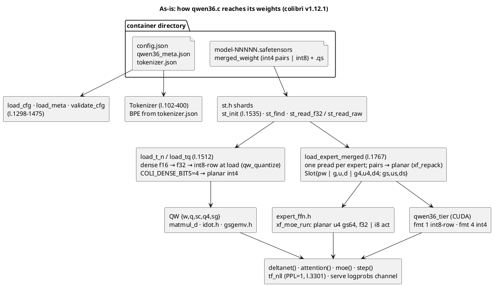
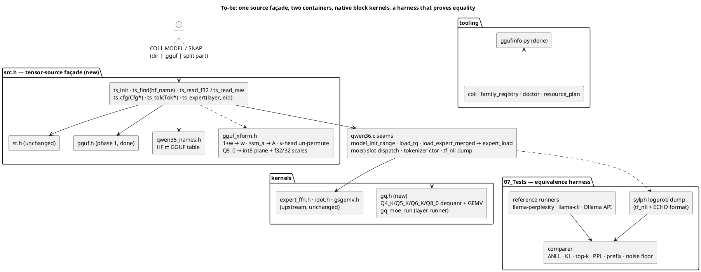
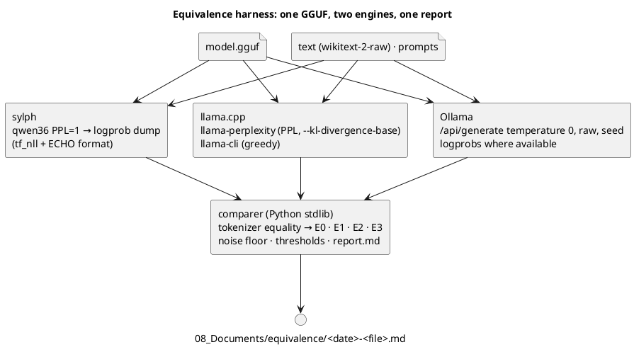

# GGUF support — architecture

Status: **v2, proposal awaiting owner review** (2026-10-05). Specification:
`../02_Specifications/gguf-specification.md`; progress: `../04_Tasks/tasks.md`.
Written against the upstream colibrì tree merged into `06_Code/` (JustVugg/colibri
`ce370e8`, v1.12.1); line references are to that revision, paths relative to
`06_Code/` unless stated. Diagrams are PlantUML.

The v1 design (2026-10-04) targeted the GLM-5.2 engine. Its reader and kernel design
carry over unchanged; §§2, 6–9 are rewritten for the `qwen36` engine and the Qwen3.6
GGUF layout, and §10 adds the equivalence harness the owner requires.

## 1. Design in one paragraph

Give the `qwen36` engine a second **model source** (GGUF) and a second **weight format
family** (ggml block types) without touching its math: `deltanet()`, `attention()`,
`moe()`, the LRU/pin/pilot machinery and the CUDA tier keep working on the same
structures. A thin **tensor-source façade** answers the engine's HF-named requests from
either the safetensors container or a GGUF; a **transform layer** undoes, losslessly,
what llama.cpp's converter did to values and head order; **native K-quant kernels**
compute on the blocks as stored, and a **harness** proves the result equals ggml's.

## 2. As-is: the `qwen36` engine's seams (`c/qwen36.c`, v1.12.1)



Facts the design depends on (all verified in the source):

- **Dense weights are loaded through `load_t_n`/`load_tq` by HF name** (e.g.
  `model.layers.%d.linear_attn.in_proj_qkv.weight`, l.1571–1630) as f32 and quantized
  to int8-row (or planar int4) *at load*; the engine never sees the container's
  dense dtype after that. A GGUF source therefore needs only to hand back **f32 or
  int8-with-scales** for dense tensors.
- **Routed experts** come from one `merged_weight` per expert (`[gate|up|down]`,
  int4 pairs or int8) plus a `.qs` scale vector; `load_expert_merged` picks the
  layout by **byte count** and repacks int4 to the planar layout `expert_ffn.h`
  computes on. The slot owns raw bytes; `moe()` consumes `Slot`s through
  `xf_moe_run` (planar) or the int8 GEMVs. A GGUF expert needs a **third slot
  flavour**: raw K-quant blocks with their types.
- **Config** comes from `config.json` + `qwen36_meta.json` (`load_meta` keys: `q_heads`,
  `kv_heads`, `head_dim`, `q_head_dim`, `k/v_head_dim`, `o_in`, `rope_dim`,
  `expert_gs`, `num_experts`, `topk`, `moe_inter`, `shared_inter`, `dn_vheads`,
  `dn_kheads`, `dn_kdim`, `dn_vdim`, `dn_convk`, `dn_conv_dim`, `layer_types`,
  `partial_rotary_factor`, `rope_theta`, `rms_eps`, flags). GGUF carries every one of
  these under `qwen35moe.*` keys or derivable from tensor shapes (§6).
- **RMSNorm** is `x·rsqrt(ms+eps)·(1+w)` (`rmsnorm_row`, l.1284); the DeltaNet gated
  norm uses plain `w`. GGUF stores `1+w` for the former (§7).
- **DeltaNet** (`deltanet()`, docs/qwen36-phase02.md): `g = −exp(A_log)·softplus(a+dt_bias)`,
  v-head `h` reads k-head `h / (vh/vk)` (repeat-interleave). GGUF reorders v-heads so
  that v-head `i` would read k-head `i mod vk` (§7); the engine stays on HF order by
  un-permuting at load.
- The engine already has the two measurement hooks the harness needs: **`tf_nll`**
  (teacher-forced NLL, `PPL=1`) and the serve protocol's **`logprobs=k` / `ECHO`**
  channel that emits per-position log-probs in a fixed text format.
- `coli` picks the engine from the **family registry** (`family_registry.py`,
  `model_type` = `qwen3_5_moe`); `doctor.py`/`resource_plan.py` read the container.

## 3. To-be: components



| File | Role | Size |
|---|---|---|
| `c/gguf.h` | GGUF v3 reader (phase 1, done). | 600 lines |
| `c/ggufinfo.py` | stdlib reader for the Python tools (done). | 450 lines |
| `c/gq.h` | ggml block types: table, dequant rows, GEMV/GEMM, fused gate+up, K-quant MoE layer runner, `Q8_0` split, selftest. | ~1100 lines |
| `c/src.h` | tensor-source façade over `st.h`/`gguf.h`; engine-agnostic. | ~450 lines |
| `c/qwen35_names.h` | HF ⇄ GGUF names for `qwen35moe` (and the GLM table from v1 as `glm_names.h` when that engine follows). | ~120 lines |
| `c/gguf_xform.h` | load-time un-transforms (norm offset, `ssm_a`, head permutation, `Q8_0` split). Pure functions on buffers, unit-tested against the audit data. | ~250 lines |
| `c/tools/st2gguf.py` | HF/container snapshot → `qwen35moe` GGUF at F32/F16/Q8_0 (applying the converter's transforms, so the tiny oracle can be written without llama.cpp). | ~400 lines |
| `07_Tests/…/equivalence/` | harness: dump readers, reference runners, comparer, `make equivalence`. | Python |

Touched upstream files: `c/qwen36.c` (seams below), `c/coli`/`family_registry.py`
(GGUF source detection), `c/resource_plan.py`, `c/Makefile`, docs.

## 4. `gguf.h` — done (phase 1)

Unchanged from v1 (§4 of the 2026-10-04 document, kept in git history): bounded
parser, splits, mirror, name index, typed KV access, `gguf_dump`. Verified on three
real models; see `08_Documents/`.

## 5. `gq.h` — ggml block formats on the CPU

### 5.1 Types (verified occurrences in the Qwen3.6 Q4_K_M files)

| id | name | block | bytes | bpw | layout | used for |
|---|---|---|---|---|---|---|
| 0 | `F32` | 1 | 4 | 32 | — | norms, routers, `ssm_a/alpha/beta/conv1d/dt/norm`, `ffn_gate_inp_shexp` |
| 30 | `BF16` | 1 | 2 | 16 | bf16 | bartowski MTP routers |
| 8 | `Q8_0` | 32 | 34 | 8.5 | `f16 d; i8 qs[32]` | `attn_q/k/v/output`, `attn_qkv`, `attn_gate`, `ssm_out`, `ffn_*_shexp`, `token_embd`, bartowski `output` |
| 12 | `Q4_K` | 256 | 144 | 4.5 | `f16 d, dmin; u8 scales[12]; u8 qs[128]`, 8 sub-blocks, `d·sc·q − dmin·m` | `ffn_gate_exps`, `ffn_up_exps` |
| 13 | `Q5_K` | 256 | 176 | 5.5 | `Q4_K` + `u8 qh[32]` | `ffn_down_exps` (unsloth) |
| 14 | `Q6_K` | 256 | 210 | 6.56 | `u8 ql[128]; u8 qh[64]; i8 scales[16]; f16 d`, `d·sc·(q−32)` | `ffn_down_exps` (bartowski), unsloth `output.weight` |

### 5.2 Kernels

```c
gq_deq_row_T(row, out, I)                      /* reference, bit-exact vs ggml (E0) */
gq_dot_row_T(row, x, I)  / _avx2 / _avx512 / _neon
gq_matmul(y, x, type, w, S, I, O)              /* OMP over rows; dense Q6_K/Q8_0 lm_head path */
gq_embed_row(type, w, row, out, I)             /* one-row dequant: token_embd lookup */
gq_moe_run(out, x, S, K, H, F, experts[], ...)  /* K-quant twin of xf_moe_run: gate+up fused over the
                                                    touched experts, silu, down, rank-ordered sum */
gq_q8_0_split(blocks, I, O, int8_plane, scales) /* lossless: Q8_0 → int8 [O][I] + f32 [O][I/32] */
gq_selftest()
```

- **Numerics.** f32 activations, exact dequantized weights, fma accumulation: the
  "exact" class. The int8-activation twin (`Q8_K`-style: one int8 scale per 32 with
  block sums) is the same opt-in policy as upstream's `IDOT`/`QWEN_EXPERT_ACT`,
  measured per spec §4.2 before any default changes.
- **`Q8_0` dense via upstream kernels.** `gq_q8_0_split` turns a `Q8_0` matrix into
  exactly the input `gsgemv.h`'s `matmul_q_gs(gs=32)` and the `idot.h` group paths
  expect; values are the stored int8, scales widen f16 → f32. So every attention,
  DeltaNet and shared-expert projection runs on **upstream's existing, tested
  kernels** and the CUDA tier's int8 upload path can follow with a per-group scale
  (phase 5). No new dense kernel except for the `Q6_K` lm_head.
- **`Q6_K` lm_head** (unsloth: 248 320 × 2048, 417 MB, one GEMV per token): `gq_matmul`
  with the 16-sub-block `Q6_K` dot; measured against upstream's int8 lm_head
  (12.6 → 10.2 ms/token on their host) as the NFR-7 reference point.
- **Experts.** `gq_moe_run` mirrors `xf_moe_run`'s contract (same signature shape,
  same scratch sizing, same rank-ordered reduction) so `moe()` dispatches on the slot
  flavour and nothing else changes. Per expert: gate/up `Q4_K` 512 rows × 1152 B,
  down `Q5_K` 2048 rows × 352 B (or `Q6_K` 420 B).

### 5.3 Slot flavour

`Slot` gains `uint8_t *kq; uint8_t ktype[3];` — the three raw slices and their ggml
types — next to the existing `pw` (planar int4) and `g,u,d` (int8). `is_int4`
semantics are untouched; `tier_offer_slot` offers nothing for `kq` slots until phase 5
(the tier then refuses by type, FR-36).

## 6. `src.h` — façade and `Cfg` from metadata

```c
typedef enum { TS_SAFETENSORS, TS_GGUF } TsKind;
typedef struct { const char *name; int fd, file; int64_t off, nbytes, numel; int st_dtype, ggml_type; int n_dims; int64_t ne[4]; } TsTensor;
typedef struct { TsTensor w; TsTensor q; int has_q; } TsPart;               /* weight (+ .qs) */
typedef struct { int n; TsPart p[3]; int ggml_type[3]; } ExpertParts;        /* gate, up, down */
typedef struct { TsKind kind; shards S; GgufSet G; const char *arch; } TensorSource;

ts_init(TensorSource*, path, extra_dirs)      ts_find(TS*, hf_name, TsTensor*)      ts_has
ts_read_f32(TS*, hf_name, dst, cap, drop)     /* widens F16/BF16/F32; applies gguf_xform for norms / ssm_a / permuted rows */
ts_read_q8(TS*, hf_name, QW*)                 /* GGUF Q8_0 → int8 plane + scales (gs 32); container → unchanged load_tq path */
ts_expert(TS*, Cfg*, layer, eid, ExpertParts*)
ts_cfg(TS*, Cfg*, path)                       ts_tok(TS*, ...)                      ts_describe
```

Rules: the safetensors arm **delegates verbatim** to `st.h` (NFR-5); name translation
only in `ts_find`/`ts_has` via `qwen35_names.h`; `ts_expert` is the only place that
knows experts are 3-D slices in GGUF and one `merged_weight` in the container.

### 6.1 Name table (`qwen35moe`, verified 2026-10-05)

| HF name (engine) | GGUF name | type seen |
|---|---|---|
| `model.embed_tokens.weight` | `token_embd.weight` | Q8_0 |
| `model.norm.weight` / `lm_head.weight` | `output_norm.weight` / `output.weight` | F32 / Q6_K·Q8_0 |
| `model.layers.N.input_layernorm.weight` | `blk.N.attn_norm.weight` (**1+w**) | F32 |
| `model.layers.N.post_attention_layernorm.weight` | `blk.N.post_attention_norm.weight` (**1+w**) | F32 |
| `self_attn.q_proj/k_proj/v_proj/o_proj.weight` | `blk.N.attn_q/attn_k/attn_v/attn_output.weight` | Q8_0 |
| `self_attn.q_norm/k_norm.weight` | `blk.N.attn_q_norm/attn_k_norm.weight` (**1+w**) | F32 |
| `linear_attn.in_proj_qkv.weight` `[8192,2048]` | `blk.N.attn_qkv.weight` `{2048,8192}` (**v rows permuted**) | Q8_0 |
| `linear_attn.in_proj_z.weight` `[4096,2048]` | `blk.N.attn_gate.weight` (**rows permuted**) | Q8_0 |
| `linear_attn.in_proj_a.weight` / `in_proj_b.weight` `[32,2048]` | `blk.N.ssm_alpha.weight` / `ssm_beta.weight` (**rows permuted**) | F32 |
| `linear_attn.conv1d.weight` `[8192,1,4]` | `blk.N.ssm_conv1d.weight` `{4,8192}` (**v channels permuted**) | F32 |
| `linear_attn.dt_bias` `[32]` | `blk.N.ssm_dt.bias` (**permuted**) | F32 |
| `linear_attn.A_log` `[32]` | `blk.N.ssm_a` = **−exp(A_log)**, permuted | F32 |
| `linear_attn.norm.weight` `[128]` | `blk.N.ssm_norm.weight` (plain w) | F32 |
| `linear_attn.out_proj.weight` `[2048,4096]` | `blk.N.ssm_out.weight` (**input columns permuted**) | Q8_0 |
| `mlp.gate.weight` | `blk.N.ffn_gate_inp.weight` | F32 |
| `mlp.shared_expert_gate.weight` `[1,2048]` | `blk.N.ffn_gate_inp_shexp.weight` | F32 |
| `mlp.shared_expert.{gate,up,down}_proj.weight` | `blk.N.ffn_{gate,up,down}_shexp.weight` | Q8_0 |
| `mlp.experts.E.*` (container: `merged_weight`) | slice E of `blk.N.ffn_{gate,up,down}_exps.weight` | Q4_K / Q4_K / Q5_K·Q6_K |
| — | `blk.40.nextn.{eh_proj, enorm, hnorm, shared_head_norm}` (bartowski only) | Q8_0 / F32 |

### 6.2 `Cfg` from `qwen35moe.*` keys

| `Cfg` field | Source | Qwen3.6 value |
|---|---|---|
| `hidden` | `embedding_length` | 2048 |
| `n_layers` | `block_count` (− `nextn_predict_layers` if present) | 40 |
| `vocab` | `len(tokenizer.ggml.tokens)` = `output.weight.ne[1]` | 248 320 |
| `q_heads`, `kv_heads` | `attention.head_count`, `head_count_kv` | 16, 2 |
| `head_dim`, `k/v_head_dim` | `attention.key_length` (= `value_length`) | 256 |
| `q_head_dim` | `attn_q.ne[1] / q_heads` (output gate doubles it) | 512 |
| `o_in` | `attn_output.ne[0]` | 4096 |
| `rotary_dim`, `partial_rotary_factor` | `rope.dimension_count`; factor = rotary/head_dim | 64, 0.25 |
| `theta`, `eps` | `rope.freq_base`, `attention.layer_norm_rms_epsilon` | 1e7, 1e-6 |
| `n_experts`, `topk`, `inter`, `shared_inter` | `expert_count`, `expert_used_count`, `expert_feed_forward_length`, `expert_shared_feed_forward_length` | 256, 8, 512, 512 |
| `norm_topk`, `n_group`, `topk_group`, scoring | absent in GGUF → container defaults (`norm_topk_prob=false`, 1, 1, softmax) | |
| `is_attn[i]` | `full_attention_interval` (i % 4 == 3) **and** presence of `attn_q` vs `attn_qkv` | 10 attention blocks |
| `dn_vheads`, `dn_kheads` | `ssm.time_step_rank`, `ssm.group_count` | 32, 16 |
| `dn_kdim`, `dn_vdim` | `ssm.state_size` (both) | 128 |
| `dn_convk`, `dn_conv_dim` | `ssm.conv_kernel`, `attn_qkv.ne[1]` (= 2·16·128 + 32·128) | 4, 8192 |
| `attn_output_gate`, `has_qk_norm` | from shapes / presence of `attn_q_norm` | true, true |
| `expert_gs`, `ebits` | not applicable to GGUF slots (types per tensor) | — |
| stop ids | `tokenizer.ggml.eos_token_id` (248046) ∪ family registry names | |

`validate_cfg` runs unchanged afterwards. `rope.dimension_sections` `[11,11,10,0]`
(mrope for the vision checkpoint) is ignored for text, as `mrope_section` is today.

## 7. Value transforms (`gguf_xform.h`) — audited

Audited on 2026-10-05 against the owner's HF-named container
(`Kreuzzelg/qwen36-35b-a3b-colibri-i4-gs64`, f16) and unsloth's `UD-Q4_K_M` GGUF,
layer 0 and 3 (`08_Documents/scripts/perm_check.py`, `transform_check.py`):

| Transform in the GGUF | Evidence | Undo at load |
|---|---|---|
| `attn_norm`, `post_attention_norm`, `attn_q_norm`, `attn_k_norm` store **1 + w** | max \|GGUF − (1+HF)\| = 0 | subtract 1 in f32 (`rmsnorm_row` keeps its `(1+w)`) |
| `ssm_norm` stores **w** | max diff 0 | none |
| `ssm_a` stores **−exp(A_log)** | max diff 1.7e-6 after permutation | keep as `A` and compute `g = A·softplus(a+dt_bias)` (one new `Layer` field `dn_A`, or `A_log = log(−A)` to keep the field) |
| **value-head permutation** `perm[i] = 2i (i<16), 2(i−16)+1 (i≥16)` on `ssm_a`, `ssm_dt.bias`, `ssm_alpha`/`ssm_beta` rows, `attn_gate` rows, the v third of `attn_qkv` rows and of `ssm_conv1d` channels, `ssm_out` input columns | exact (0 / 3e-8) for F32 tensors; Q8_0 rows match within quantization noise (rel 0.005) only under the permutation | gather rows/channels/columns back to HF order while copying into the engine's buffers (a permutation of 128-wide blocks; lossless) |
| q/k heads | identity | none |
| `ssm_conv1d` `{4, 8192}` | identical row-major to HF `[8192,1,4]` | none |
| `Q8_0` blocks | — | split into int8 plane + f32 scales (lossless) |

The permutation is what llama.cpp needs for its grouped recurrence (v-head `i` reads
k-head `i mod 16` instead of `i / 2`); undoing it keeps `deltanet()` byte-identical.
The audit script re-runs whenever a new converter release appears (spec §9).

## 8. Load path and expert streaming in `qwen36.c`

- `model_init_range`: `st_init(&m->S, snap)` → `ts_init(&m->src, snap)`; `load_t_n`/
  `load_tq` → `ts_read_f32`/`ts_read_q8` (container arm unchanged; GGUF arm returns
  int8 plane + per-32 scales into `QW` with a new `gs` field, consumed by
  `matmul_q_gs`). `load_cfg`+`load_meta` → `ts_cfg`.
- `load_expert_merged` → `expert_load`: container arm as today; GGUF arm reads the
  three slices (offset-ordered, O_DIRECT windows per slice) into `Slot.kq`.
- `moe()`: `xf_mode` → slot flavour dispatch: `pw` → `xf_moe_run`, `kq` → `gq_moe_run`,
  `g/u/d` → int8 path. Pilot/LRU/pin unchanged.
- Tokenizer: the BPE builder (l.102–400) gets an array constructor; `pre = qwen35`
  → the Qwen pre-tokenizer already in the engine.
- Sidecars: `<dir>/.coli-<stem>/` (v1 §9.3).
- CUDA tier: `tier_offer_slot` skips `kq` slots in v1 (FR-36); phase 5 adds K-quant
  uploads and kernels in `qwen36_tier.c`/`backend_cuda.cu`.

```plantuml
@startuml
title One routed expert from a qwen35moe GGUF
skinparam componentStyle rectangle
rectangle "blk.L.ffn_gate_exps  Q4_K {2048, 512, 256}" as g { rectangle "e: 512 rows × 1152 B" as ge #lightblue }
rectangle "blk.L.ffn_up_exps    Q4_K {2048, 512, 256}" as u { rectangle "e: 512 rows × 1152 B" as ue #lightblue }
rectangle "blk.L.ffn_down_exps  Q5_K {512, 2048, 256}" as d { rectangle "e: 2048 rows × 352 B" as de #lightblue }
rectangle "Slot.kq (≈1.9 MB)\n[gate | up | down] raw blocks, ktype[3]" as slot
ge --> slot : pread
ue --> slot : pread
de --> slot : pread
slot --> "gq_moe_run (f32 act)" 
@enduml
```

## 9. Python side

- `ggufinfo.py` (done): `ENGINE_ARCHS = {qwen35moe: qwen36, glm-dsa: glm}`.
- `coli`/`family_registry.py`: `resolve_model(path)` accepts a GGUF source and maps
  `general.architecture` to the family; everything downstream (templates, serve
  protocol, budgets) is the family's.
- `doctor.py` (done for the reader), `resource_plan.py`: expert bytes from slices,
  dense bytes from the type mix.

## 10. Equivalence harness (`07_Tests/`, spec §4–5.5)



- **Tokenizer equality first**: the same text tokenized by sylph and by the reference
  (`llama-tokenize`) must give identical ids; otherwise E1–E3 compare different inputs.
- **E1/E2 protocol** = llama.cpp's: text split into `n_ctx = 512` windows, the second
  half of each window scored, 16 chunks (owner's #1370 setting), all in f32 log space.
  The sylph dump reuses `tf_nll` for the sum and a per-position tail for the detail.
- **Noise floor**: llama.cpp vs itself at two thread counts and (if available) CPU vs
  CUDA; thresholds = 3× floor; recorded in the report.
- **CI subset**: E0 on synthetic blocks; E1 on the tiny model with the transformers
  forward pass (torch in CI, as upstream's tiny-oracle job) as reference, compared through
  the `PPL_DUMP` format of `07_Tests/SystemTest/lossless_oracle.md`. *Amended 2026-10-06:*
  the container cannot be the reference, `convert_qwen36.py` quantizes experts to int8 at best.
- **Entry point**: `make -C 06_Code/c equivalence MODEL=<gguf> LLAMA=<llama.cpp bin dir> [OLLAMA=http://host:11434 TAG=…]`.

## 11. Testing strategy

| Layer | Tests |
|---|---|
| unit (`make check`) | `test_gguf.c` (done), `test_gq_kernels.c` (E0 vs Python reference, SIMD parity, runner == GEMVs), `test_gguf_xform.c` (norm offset, `ssm_a`, permutation on synthetic data shaped like the audit), `test_tok_gguf.c`, `test_gguf_load.c` (tiny `qwen35moe` GGUF through `model_init_range`: `Cfg`, names, slot bytes, Q8_0 split) |
| integration (`07_Tests/IntegrationTest`) | reader cross-check (done); kernels vs llama.cpp dequant dump; façade on both tiny sources yields identical `Cfg` and dense buffers |
| system (`07_Tests/SystemTest`) | inspect real GGUF (done); **lossless oracle** from an F32 GGUF of the tiny Qwen3.6; **equivalence E1–E3** on the real model (owner's machine); **A/B** per `docs/benchmarking.md` |

**Amendment 2026-10-05 (after the owner's review).** Upstream v1.12.1 already ships a
stdlib GGUF reader (`tools/gguf_reader.py`) and a numpy dequantizer ported from ggml
(`tools/gguf_dequant.py`, pinned by gguf-py golden vectors) for its GGUF→OLMoE
converter. The E0 oracle therefore is: llama.cpp's gguf-py golden vectors committed under
`07_Tests/IntegrationTest/fixtures/e0/` (real Qwen3.6 rows of every type + synthetic edge
blocks), with upstream's module as the second, independent decoder (16/16 bit-exact on
2026-10-05). The planned `tools/gq_ref.py` is dropped. The C reference decode must keep
ggml's expression order and must not be FP-contracted (`-ffp-contract=off`), otherwise
the sign of zero and the last bit differ from the golden. Contract of the test binary:
`07_Tests/IntegrationTest/gq_kernels.md`. Names as implemented in `c/gq.h` (2026-10-06): `gq_row_bytes` (not `gq_row_size`), `gq_deq_row(type, …)` and `gq_dot_row(type, …)` dispatching on the type id (no per-type `_T` suffix in the public entry points), `gq_dot_row_xs` + `gq_xsum32` for the per-token activation sums the K-quant min terms need, `GqExpert{g,u,d,tg,tu,td}` for `gq_moe_run`. The dot numerics follow `expert_ffn.h`'s rule (8 lanes = element & 7, fma, fixed 8→1 tree) with four independent accumulators per row; NFR-7 result in `08_Documents/kernels/`.

**Amendment 2026-10-06 (phase 3 as implemented).** `ts_cfg` lives in `qwen36.c` as `cfg_from_gguf(Model*)` (it fills the engine's `Cfg`, so it is engine code; `src.h` stays engine-agnostic and receives the head geometry it needs for the un-permutations). The GGUF slot flavour is `Slot{kq, ktype[3], kbytes[3]}` sized for the largest expert of any block (`ffn_down_exps` alternates `Q5_K`/`Q6_K`), run by `moe_gq_run`, the twin of `moe_xf_run`. Dense GGUF matrices: `Q8_0` → `QW{q, sc, gs = 32}` for `matmul_q_gs`; `Q4_K/Q5_K/Q6_K/Q4_0` → `QW{kq, ktype}` for `gq_matmul`; F32/F16/BF16 take the container's int8-at-load path; with `COLI_DENSE_I8=0`, or when a permuted `Q8_0` matrix cannot move whole blocks (tiny fixtures), the exact f32 dequantization is used (never a re-quantization). The embedding table is dequantized to f32 at load as the container path does (phase 4 switches to `gq_embed_row`). `SNAP=<file.gguf>` or a directory of parts selects the source; the tokenizer comes from the metadata via `load_tokenizer_gguf` (a `tokenizer.json` via `TOK=` is preferred when given). A1 is resolved as "keep `dn_alog`": the GGUF `ssm_a` is turned back into `A_log` at load (≤ 4·2⁻²⁴ absolute), `deltanet()` is untouched.

**Amendment 2026-10-08 (phase-4 tests written; findings).** (1) `qwen36.c` has none of
the `DIRECT`/`COLI_MODEL_MIRROR`/`URING`/`COLI_MODEL_DIRS` machinery of `colibri.c`
(`grep` empty); experts are read with `pread` + `posix_fadvise(DONTNEED)`, and the GGUF
arm inherits exactly that. §8's "O_DIRECT windows per slice" is therefore **not** a
phase-4 item: FR-28 is satisfied vacuously, the knobs are ignored identically on both
sources (`expert_streaming.md` case 9), and a mirror/split feature for this engine
would be upstream work first. (2) The engine writes no sidecar (`route_trace.h` is not
included; `kv_prefix.h` is in-memory), and `coli`'s `.coli_kv`/`.coli_ssd` belong to the
GLM engine; FR-29 becomes a **path rule**: `<dir>/.coli-<stem>/` from `ts_sidecar_dir`
(`src.h`) and `family_registry.sidecar_dir`, created only when something is written,
printed by `coli info` and in the startup line. (3) The FR-30 startup line and a
`GGUF reads:` statistics line (slices = 3 × misses, MB, MB/token, parts touched) are the
machine-readable form the tests parse; the format is fixed in `expert_streaming.md`.
(4) `token_embd` moves to `gq_embed_row` on demand with `COLI_GGUF_EMBED=0` as the A/B
knob (bit-identical dumps required). (5) `tools/st2gguf.py --split N` writes the
`gguf-split` layout so split sets are tested on the tiny fixture. (6) The equivalence
harness lives in `07_Tests/SystemTest/equivalence/` (stdlib), reached by
`make -C 06_Code/c equivalence …` as the oracle scripts already are; its interchange
formats (`ppl-dump v1`, `full-logprob v1`, `e2-chunks v1`, `e3-gen v1`) and the
`llama-server` `/completion` `n_probs` route (token ids + log-probs, preferred over
`llama-cli`'s text) are fixed in `equivalence.md`; the engine gains `PPL_DUMP_FULL` for
exact KL and `test_tok_gguf --encode` for the tokenizer gate. (7) `convert_qwen36.py`
imports torch, so the streaming test's container cases run in the `gguf-oracle` job.

**Amendment 2026-10-09 (phase 4 as implemented).** Names: `ts_sidecar_dir`,
`ts_read_rows_any` (raw rows of any supported dense type, for `token_embd`),
`ts_parts_touched`, the counters `rd_slices`/`rd_bytes`/`touched[]` in `TensorSource`;
`gguf_embd_on_demand()` and `gguf_reads_line()` in `qwen36.c`; `Model{embd_raw, embd_type}`
(`embed == NULL` when the rows are decoded per token). The FR-30 line is composed by
`ts_describe(ts, buf, cap, embd_mode, out_kernel, slot_bytes)`. The harness lives in
`07_Tests/SystemTest/equivalence/` and `make -C 06_Code/c equivalence` calls it; its
interchange formats are in `equivalence/formats.md`. The ppl-dump tail is the engine's
` <lp> <k> <id> <lp> …` (unordered); the first comparer parsed `<id>:<lp>` and its top-1
check was vacuous — fixed, and the comparer now refuses dumps without tails. E1/E2
windows follow llama.cpp exactly: 255 scored targets (257…511) per 512-id window.

**Amendment 2026-10-09 (phase-5 tests written; design fixed by them).** (1) The tier takes raw
ggml blocks as **device formats `fmt = 16 + ggml type id`** (`Q8_0` 24, `Q4_K` 28, `Q5_K` 29,
`Q6_K` 30) with their own kernel branch — never through `weight_at`, whose predicate stays as it
is; `coli_cuda_block_fmt_supported/_type/_elems` are the host-checkable gates
(`tests/test_cuda_block_fmt_guard.c`). An upload carries no scale array (`sc == NULL`) and is
refused when `I` is not a whole number of blocks. (2) `qt_init_gguf(nl, ne, D, Ih, cap, topk,
slot_bytes[3], types_present)` prices an expert as the sum of the three slice footprints and
refuses by type (FR-36); `qt_note_kq[_planned|_block](layer, eid, kq, ktype[3], kbytes[3])`
stages the three raw slices; `tier_offer_slot` offers `kq` slots first; `qt_dense_init_kq`
places GGUF dense matrices (a `Q8_0` split is re-joined with `gq_q8_0_join`, decision A3
stands on the CPU). (3) **FR-37 read precisely:** every block GEMV on the device is bit-identical
to `gq_dot_row_ref` (hence to the CPU expert path), and the engine sums routed experts in rank
order with `fmaf` on both paths and adds the shared expert afterwards; the device `expf` in the
SiLU and the dense `Q8_0` split-vs-raw kernel are the two named deviations, measured as
sylph-CPU vs sylph-CUDA in `gpu_rtx3070.md` (bounds 1e-5 / 1e-4, beside llama.cpp's own
CPU-vs-CUDA floor). On the fake backend (host `expf`, trunk on the CPU) the dumps are
byte-identical, which is what `make check` demands. (4) The planner gains `trunk_gguf_bytes`
(stored bytes of `output`, `attn_qkv`+`attn_gate`, `ssm_out`, `attn_q/k/v/output`,
`ffn_*_shexp`), treated as the container's `trunk_int8_bytes`. (5) Fixtures: the tiny preset
cannot hold 256-element blocks; `make_tiny_qwen36_hf.py --hidden 256 --inter 256` and
`st2gguf --expert-type q4_k|q5_k|q6_k --down-type` produce the K-quant fixture. (6) The int8-
activation twin (FR-14) is opt-in on the GGUF path (`QWEN_EXPERT_ACT=i8`, default f32); the
container keeps upstream's default.

**Amendment 2026-10-09 (phase 5 as implemented).** As designed above, with these names
and findings: `blk_lane`/`blk_row`/`blk_matmul`/`grouped_hidden_blk_dual`/`grouped_down_blk`
in `backend_cuda.cu` (one row = eight threads, one per reference lane, the eight partials
folded by lane 0 with `gq_hsum8_scalar`'s tree; a 256-thread block covers 32 rows; the
reduction order depends on the type and `I` only); the f16 decode is the integer path of
`gq_f16_to_f32`, so no fp16 intrinsic is involved. The tier's slot keeps `kt[3]/kb[3]`
and points `g4/u4/d4` into the slab, so `enqueue_locked`, the LFRU and `qt_fill_next`
work unchanged; the upload queue entry carries the slice description. The `[GGUF]` line
moved to after the tier decision (`Model.gguf_line`, `g_defer_gguf_line`), which is
where "experts on CUDA tier (<n> planned)" is known. CPU misses on a GGUF run through
`gq_expert_cpu` (`gq_matmul` rows + `gq_swiglu`), the same kernels and activation sums as
`gq_moe_run`, so a miss and a resident expert agree to the bit; the mixed-residency sum
order (misses before hits) is the one documented gate-level difference. The int8-
activation twin lives in `gq_i8.h`: per-32 int8 activation blocks with one f32 scale
(finer than ggml's Q8_K per-256), integer dots on AVX2 (`maddubs`/`madd`), the scalar
twin as the reference of the SIMD twin (1e-5 relative, not bit-for-bit: a deviation,
not a reference). The `Q8_0` dense matrices exist as the lossless split only with the
dense-int8 path on; with `COLI_DENSE_I8=0` they are f32 and nothing is offered to the
placer (the phase-4 harness default) — the system test runs the CUDA arm with the default.

## 12. Phased plan (details and status in `../04_Tasks/tasks.md`)

| Phase | Deliverables | Exit |
|---|---|---|
| 1 — reader | done | verified on 3 real models |
| 2 — kernels | `gq.h` (types of §5.1), `gq_q8_0_split`, `gq_moe_run`, `gq_matmul` for `Q6_K`/`Q8_0` lm_head, Python reference, tests, selftest | E0 bit-exact; SIMD parity; NFR-7 measured |
| 3 — assembly | `src.h`, `qwen35_names.h`, `gguf_xform.h`, `ts_cfg`, tokenizer ctor, `model_init_range` through the façade, logprob dump, `st2gguf.py`, `coli` family detection | **lossless oracle** from an F32 GGUF; container oracle unchanged |
| 4 — streaming + harness | `kq` slots, 3-slice loads, O_DIRECT/mirror/split, sidecars, startup line; reference runners, comparer, `make equivalence`; first E1–E3 and A/B on the owner's machine | spec §8 items 4–6 |
| 5 — GPU | K-quant and `Q8_0`-group uploads/kernels in the tier; placement on the RTX 3070; E1–E3 CPU vs CUDA | tier bit-equal to CPU; A/B on the card |
| 6 — breadth | GLM-5.2 (`glm-dsa`, v1 design), MTP, more types, upstream sync tooling | per item |

## 13. Open design decisions

| # | Question | Default |
|---|---|---|
| A1 | Keep `A_log` in `Layer` (compute `log(−A)` at load) or add `dn_A`? | add `dn_A` and let `deltanet()` take `A` directly; the container arm computes `−exp(A_log)` once at load (same math, one `exp` fewer per token) — confirmed bit-stable? to be measured on the oracle |
| A2 | Un-permute at load vs. permute the engine's k-head lookup? | un-permute at load (engine untouched, oracle unchanged) |
| A3 | `Q8_0` dense: split to int8+scales (upstream kernels) vs native `Q8_0` kernel? | split (lossless, reuses tested kernels and the tier path) |
| A4 | Where does the logprob dump live? | `qwen36.c`, extending `PPL=1` with `PPL_DUMP=<file>`; format = the serve protocol's logprob tail |
| A5 | lm_head `Q6_K` kernel: f32 or int8 activations by default? | f32 (exact class); int8 opt-in measured |
